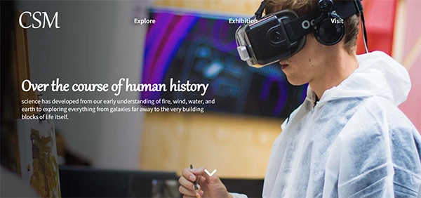

# SemesterProject

# Community science museum



The assignment was to make an appealing website for the new museum opening in town. “The website should be informative and engaging, encouraging viewers to visit the museum. The website should be responsive and easy to use on various devices.” 

## Description

The website was made to target primary and middle school children and families with young children. It needed at least 4 to 6 pages and should have information for the teachers and scientists. The HTML and CSS were supposed to be neat and follow the DRY principle. This project had a lot of focus on the design too, it needed to be sophisticated enough for a museum and still make children pay a visit. Under is some of the criteria we had to meet 

Under is some of the requirements we had to meet

- Your HTML should be semantic and neatly indented. 
- The site should use external CSS style sheets which follow the DRY principle. 
- The site should download quickly and not be overly “heavy” Images should be at most 200kb. 
- The site should be responsive, attractive, and easy to use on various devices. 
- USE WCAG principles, especially regarding hierarchy, navigation, and colour usage. 

## Built With

Tech stack for this project  

- [HTML5](https://dev.w3.org/html5/spec-LC/)
- [CSS](https://www.w3.org/Style/CSS/Overview.en.html)

## Getting Started

### Installing

To clone this repo you run the command that is listed under here. From there you can make your changes and deploy it as you like. I recommend Netlify + Github. This project is written 100% by me, and you can use it however you like.

1. Clone the repo:

```bash
git clone git@github.com:bettytro/SemesterProject.git
```


### Running

This project is fully built on front-end tools like HTML & CSS. There is no dependencies or setup to make it run optimally. You can run it in your normal browser. Just open index.html in your favorite browser, and you're all good.


## Contributing

If you want to contribute to this project, you can message me on any of my socials. You can find them on my [Github profile](https://github.com/bettytro). I will not observe this project that closely, but please make a pull request, and I will review it as soon as possible.

## Contact

If you want to get in touch, please send me a message on Facebook or Discord 

[My Facebook](https://www.facebook.com/elisabeth.trondsen.14/)

[My Discord](discordapp.com/users/yourID1009006668291518517)
 
